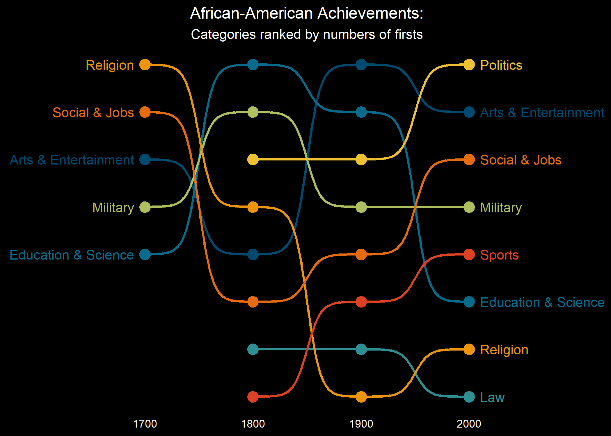

```{r, include = F}
# This is the recommended set up for flipbooks
# you might think about setting cache to TRUE as you gain practice --- building flipbooks from scratch can be time consuming
knitr::opts_chunk$set(fig.width = 6, message = FALSE, warning = FALSE, comment = "", cache = FALSE)
library(flipbookr)
library(tidyverse)
library(ggbump)
library(PNWColors)
library(ggiraph)
```

```{css, eval = TRUE, echo = FALSE}
.remark-code{line-height: 1.5; font-size: 75%}
@media print {
  .has-continuation {
    display: block;
  }
}
```

# Links

* Data: https://github.com/rfordatascience/tidytuesday/blob/master/data/2020/2020-06-09/readme.md

* {ggbump}: https://github.com/davidsjoberg/ggbump

* {flipbookr}: https://evamaerey.github.io/flipbooks/flipbook_recipes

---

```{r, include = FALSE}
firsts <- readr::read_csv('https://raw.githubusercontent.com/rfordatascience/tidytuesday/master/data/2020/2020-06-09/firsts.csv')
```

```{r bumpdata, include = FALSE}
firsts %>% 
  mutate(century = year - year %% 100,
         .after = year) %>% 
  group_by(century, category) %>% 
  summarize(n_firsts = n()) %>% 
  group_by(century) %>% 
  mutate(rank = rank(-n_firsts, 
                     ties.method = "random")) %>% 
  ungroup() -> bump_data
```

`r chunk_reveal("bumpdata", break_type = "auto", widths = c(40, 60))`

---

```{r bumpplot, include = FALSE, fig.width=10}
bump_data %>% 
  ggplot(aes(x = century, 
             y = rank, 
             color = category)) +
  geom_bump(size = 1) +
  geom_point(size = 4) +
  geom_text(data = bump_data %>% 
              filter(century == min(century)),
            aes(x = century - 10, 
                label = category),
            hjust = 1) +
  geom_text(data = bump_data %>% 
              filter(century == max(century)),
            aes(x = century + 10, 
                label = category),
            hjust = 0) +
  scale_y_reverse() +
  scale_x_continuous(limits = c(1600, 2100),
                     breaks = c(1700, 1800, 1900, 2000)) +
  scale_color_manual(values = pnw_palette("Bay", 8)) +
  labs(title = "African-American Achievements:",        
       subtitle = "Categories ranked by numbers of firsts",
       x = NULL,
       y = NULL) +
  theme_minimal() +
  theme(legend.position = "none") +
  theme(plot.background = element_rect(fill = "black")) +
  theme(panel.grid = element_blank()) +
  theme(axis.text.y = element_blank()) +
  theme(axis.text.x = element_text(color = "white")) +
  theme(plot.title = element_text(color = "white", 
                                  hjust = 0.5)) +
  theme(plot.subtitle = element_text(color = "white", 
                                     hjust = 0.5))
```

`r chunk_reveal("bumpplot", break_type = "auto", widths = c(40, 60))`

---



---

```{r, echo=FALSE}
bp <- bump_data %>% 
  ggplot(aes(x = century, y = rank, color = category)) +
  geom_bump(size = 1) +
  geom_point_interactive(aes(tooltip = n_firsts), size = 4) +
  geom_text(data = bump_data %>% filter(century == min(century)),
            aes(x = century - 10, label = category),
            hjust = 1) +
  geom_text(data = bump_data %>% filter(century == max(century)),
            aes(x = century + 10, label = category),
            hjust = 0) +
  scale_y_reverse() +
  scale_x_continuous(limits = c(1600, 2100),
                     breaks = c(1700, 1800, 1900, 2000)) +
  scale_color_manual(values = pnw_palette("Bay", 8)) +
  labs(title = "African-American Achievements:",
       subtitle = "Categories ranked by numbers of firsts",
       x = NULL,
       y = NULL) +
  theme_minimal() +
  theme(legend.position = "none",
        plot.background = element_rect(fill = "black"),
        panel.grid = element_blank(),
        axis.text.y = element_blank(),
        axis.text.x = element_text(color = "white"),
        plot.title = element_text(color = "white", hjust = 0.5),
        plot.subtitle = element_text(color = "white", hjust = 0.5))

girafe(code = print(bp),
       options = list(opts_hover(css = "stroke:white;"),
                      #                opts_hover_inv(css = "opacity:0.5;"),
                      #                opts_tooltip(opacity = 0.5),
                      opts_sizing(rescale = TRUE, width = 0.8))
)
```


